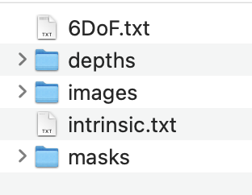

<!--
 * @Author: Qing Hong
 * @FirstEditTime: This function has been here since 1987. DON'T FXXKING TOUCH IT
 * @LastEditors: Qing Hong
 * @LastEditTime: 2024-08-16 13:01:14
 * @Description: 
 *          ▄              ▄
 *         ▌▒█           ▄▀▒▌     
 *         ▌▒▒▀▄       ▄▀▒▒▒▐
 *        ▐▄▀▒▒▀▀▀▀▄▄▄▀▒▒▒▒▒▐     ,-----------------.
 *      ▄▄▀▒▒▒▒▒▒▒▒▒▒▒█▒▒▄█▒▐     (Wow,kousei's code)
 *    ▄▀▒▒▒▒▒▒▒▒▒▒▒▒▒▒▒▀██▀▒▐     `-,---------------' 
 *   ▐▒▒▒▄▄▄▒▒▒▒▒▒▒▒▒▒▒▒▒▀▄▒▒▌  _.-'   ,----------.
 *   ▌▒▒▐▄█▀▒▒▒▒▄▀█▄▒▒▒▒▒▒▒█▒▐         (surabashii)
 *  ▐▒▒▒▒▒▒▒▒▒▒▒▀██▀▒▒▒▒▒▒▒▒▀▄▌        `-,--------' 
 *  ▌▒▀▄██▄▒▒▒▒▒▒▒▒▒▒▒░░░░▒▒▒▒▌      _.-'
 *  ▌▀▐▄█▄█▌▄▒▀▒▒▒▒▒▒░░░░░░▒▒▒▐ _.-'
 * ▐▒▀▐▀▐▀▒▒▄▄▒▄▒▒▒▒▒░░░░░░▒▒▒▒▌
 * ▐▒▒▒▀▀▄▄▒▒▒▄▒▒▒▒▒▒░░░░░░▒▒▒▐
 *  ▌▒▒▒▒▒▒▀▀▀▒▒▒▒▒▒▒▒░░░░▒▒▒▒▌
 *  ▐▒▒▒▒▒▒▒▒▒▒▒▒▒▒▒▒▒▒▒▒▒▒▒▒▐
 *   ▀▄▒▒▒▒▒▒▒▒▒▒▒▒▒▒▒▒▒▄▒▒▒▒▌
 *     ▀▄▒▒▒▒▒▒▒▒▒▒▄▄▄▀▒▒▒▒▄▀
 *       ▀▄▄▄▄▄▄▀▀▀▒▒▒▒▒▄▄▀
 *          ▒▒▒▒▒▒▒▒▒▒▀▀
 * When I wrote this, only God and I understood what I was doing
 * Now, God only knows
-->
# 用户手册

## mmgs

### 用法
本算法用于通过深度和rgb信息、六轴信息生成点云和colmap格式输入，用于训练

### 文件格式


1. images文件夹，支持png,jpg,tiff,exr
2. masks文件夹，支持png,jpg,tiff,exr
3. depths文件夹，仅支持exr
4. intrinsic.txt 内参矩阵，格式如下：

Width	Height	fx	fy
2048	1080	2120.048939	2120.048939

5. 6DoF.txt 外参六轴参数，格式如下：
   
Rot_x	Rot_y	Rot_z	Translate_x	Translate_y	Translate_z
0.000000	0.000000	0.000000	0.000000	0.000000	0.000000
0.134294	0.162051	0.038845	0.016800	-0.008170	-0.002614


### 运行方式

在控制台通过输入
```
mmgs 
```
或者
```
python algo/conversion_tools/pointcloud/3dgs_reader.py
```


### 其他参数说明
可在运行方式后添加此参数，如mmgs --root XXXX
1. --root : （必须）目标源文件夹
2. --start_frame : 从第几帧开始帧
3. --max_frame : 单次merge使用帧
4. --baseline_distance : 添加数字（单位米）, 更改相机平移位置，用于生成左右眼相机 
5. --judder_angle : 添加数字（度），生成ja差值相机
6. --step 跳帧step
7. --downscale : 生成下采样倍率的点云文件

8. --rub:输出viwer.txt的rub格式viewmatrix
   

9.--mask_type: bg or mix , mix生成2d-3d用点云,bg则只生成背景点云


## 3DGS

### 用法
本算法用于通过mmgs生成的点云结果进行高斯训练,如果对点云进行编辑，请用编辑后的点云替换后进行训练
git clone http://10.35.116.93/mm/3dgs.git
获取代码

### 文件格式
mmgs的输出文件格式

### 运行方式

使用下面代码进行训练
```
cd YOUR_3DGS_ROOT/3dgs && python train.py -r 1 -s YOUR_RAW_DATA/pointcloud --output YOUR_SAVE_NAME
```
使用下面代码进行渲染
```
cd YOUR_3DGS_ROOT/3dgs && python render.py -r 1 -s YOUR_RAW_DATA/pointcloud -m YOUR_3DGS_ROOT/output/YOUR_SAVE_NAME
```
如需生成插值ja或者左右眼结果，则：
```
cd YOUR_3DGS_ROOT/3dgs && python render.py -r 1 -s YOUR_RAW_DATA/pointcloud_ja_180(这个根据第一步的ja或baseline_distance生成文件夹决定) -m YOUR_3DGS_ROOT/output/YOUR_SAVE_NAME
```

最终图像结果会保存在 YOUR_3DGS_ROOT/output/YOUR_SAVE_NAME 中


### 其他参数说明
train:
--cur  指定前景帧,如果训练数据包含mask，则该帧前景将参与训练，同mmgs的cur

render:
--format 指定输出格式，默认为png， 可选exr,tiff,png,jpg