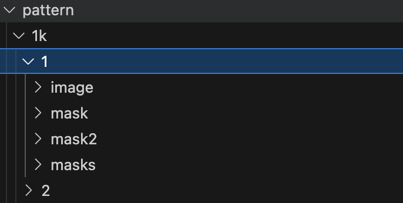
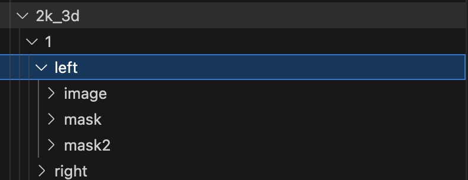

# 用户手册

## MM安装
通过执行tools/install_environment.sh (mac用户执行tools/install_environment_m2.sh)一键安装

## MM运行方式
在控制台通过输入
```
mm your_config
```
或者
```
python motionmodel/start.py your_config
```
执行MM文件，config文件默认存放于mm根目录下

## config文件
config文件主要分为以下四块：**Main,Mask,Root,Algorithms,Paramaters**
### Main
用户需要在此指定运行环境,cpu代表以cpu方式执行，mps代表使用mac芯片中的显存进行推理，数字代表使用gpu编号进行推理
```
gpu = cpu  
gpu = mps
gpu = 0,1,2
```

其次需要指定framestep来设定输出间隔，framestep=1时只输出间隔为1的MM（mv0，mv1）
比如framestep=1,2,3时 输出(mv0,mv1,mv2,mv3,mv4,mv5)
```
frame_step = 1,2,3
```
### Root
在此选项中，用户需要指定输入文件路径和输出文件路径
```
root = pattern/1k
output = result/1k
```
之后会对该路径下所有scene执行MM推理，文件结构如下图所示：


如果只需要推理单个scene，可以通过
```
enable_single_input_mode_2D = 1
root_2D =  path_to_your_scene
```
来单独执行MM

### Depth and Disparity
通过设定cal_depth= 1来开启depth模式（3D模式下生成disparity)
```
cal_depth = 1
```

## 3D
通过设定3D_mode = 1来开启3D模式
可以使用enable_single_input_mode来单独指定left_root和right_root目录，否则会默认使用以下结构


```
注：使用默认结构时需要指定左右文件夹名称
left_dir_name = left
right_dir_name = right
```


### Algorithms
用户可以通过更改算法名称来更换MM核心算法，支持的算法请参考mmalgo文件中的注释
```
algorithm = kousei
```

如果需要指定其他版本算法，可以添加版本日期，如：
```
algorithm = kousei-v1-221013
```


### Paramater
用户可以通过设定resize_rate来控制图像平滑值
```
resize_rate_x = 1
resize_rate_y = 1
```
这个值控制在0.5-1之间，值越小，所消耗的内存越小，得到的mv越平滑。
对于大图，mv质量欠佳的情况下可以尝试改小来提升平滑性

对于图像有film_border或者扩边的情况，需要添加:
```
film_border = 0,0,0,0
```
来排除边框影响，4个数值分别是，上下边框长度，左右边框宽度


对于mask模式，如果输入mask是非二值的情况，可以通过修改threshold来控制虚边
```
threshold =0
```
threshold取值为0-1，对于前景mask的情况下，0代表外圈，1代表内圈，背景mask则反之


## MM更新方法
执行tools文件夹中的update_mm.sh来更新
```
./tools/update_mm.sh
```


# MM其他工具
通过执行mmupdate或bash tools/shortcut_zsh.sh 安装快捷方式(bash终端执行shortcut_bp.sh)


# mmexrreader(python algo/conversion_tools/exr_processing/cal_mv.py)
作用：对unreal导出的exr文件计算mv和depth等信息并进行导出

## 参数说明

### 1. `--path`
- **说明**: 数据路径。
- **类型**: 字符串
- **是否必需**: 是
- **示例**: `--path /your/data/path`

### 2. `--extra_depth`
- **说明**: 使用额外的深度信息计算 mv。
- **类型**: 字符串
- **是否必需**: 否
- **示例**: `--extra_depth some_depth_info`

### 3. `--mvinmask`
- **说明**: 无掩码模式。
- **类型**: 布尔值
- **是否必需**: 否
- **示例**: `--mvinmask`

### 4. `--objmvonly`
- **说明**: 仅测试对象的 mv。
- **类型**: 布尔值
- **是否必需**: 否
- **示例**: `--objmvonly`

### 5. `--inverse_mv`
- **说明**: 逆 mv。
- **类型**: 布尔值
- **是否必需**: 否
- **示例**: `--inverse_mv`

### 6. `--onlymv`
- **说明**: 输出 HDR 到 LDR 图像。
- **类型**: 布尔值
- **是否必需**: 否
- **示例**: `--onlymv`

### 7. `--debug`
- **说明**: 启用调试模式。
- **类型**: 布尔值
- **是否必需**: 否
- **示例**: `--debug`

### 8. `--dump_depth`
- **说明**: 导出世界深度。
- **类型**: 布尔值
- **是否必需**: 否
- **示例**: `--dump_depth`

### 9. `--depth_only`
- **说明**: 仅导出世界深度。
- **类型**: 布尔值
- **是否必需**: 否
- **示例**: `--depth_only`

### 10. `--colormap`
- **说明**: 导出世界深度的彩色图。
- **类型**: 布尔值
- **是否必需**: 否
- **示例**: `--colormap`

### 11. `--MRQ`
- **说明**: 使用UNREAL电影渲染队列源。
- **类型**: 布尔值
- **是否必需**: 否
- **示例**: `--MRQ`

### 12. `--ACESCG`
- **说明**: 图像输出类型为 ACEScg。
- **类型**: 布尔值
- **是否必需**: 否
- **示例**: `--ACESCG`

### 13. `--final`
- **说明**: 生成final图片
- **类型**: 布尔值
- **是否必需**: 否
- **示例**: `--final`

### 14. `--f`
- **说明**: 强制运行。
- **类型**: 布尔值
- **是否必需**: 否
- **示例**: `--f`

### 15. `--trans_mode`
- **说明**: 测试模式。
- **类型**: 布尔值
- **是否必需**: 否
- **示例**: `--trans_mode`

### 16. `--bg_mode`
- **说明**: 背景模式。
- **类型**: 布尔值
- **是否必需**: 否
- **示例**: `--bg_mode`

### 17. `--step`
- **说明**: 仅用于背景 mv。
- **类型**: 整数
- **默认值**: 1
- **是否必需**: 否
- **示例**: `--step 10`

### 18. `--core`
- **说明**: 核心数。
- **类型**: 整数
- **默认值**: 4
- **是否必需**: 否
- **示例**: `--core 8`

### 19. `--check_mode`
- **说明**: 检查无效数据。
- **类型**: 布尔值
- **是否必需**: 否
- **示例**: `--check_mode`


# mmevaluate (python algo/conversion_tools/MM_evaluate.py)
作用：评估mm模型


## 参数说明

无需添加参数，只需要添加评估模型名称即可
如mmevaluate kousei-v0-230912480

如需更改评估数据输入输出地址，请修改 mm/evaluation/config_evaluation 中的root和output


# mmply (python algo/conversion_tools/pointcloud/cal_ply.py)
作用: 根据unreal输入源生成ply点云文件以及colmap格式内外参信息

## 参数说明

### 1. `--path`
- **说明**: 数据路径。
- **类型**: 字符串
- **是否必需**: 是
- **示例**: `--path /your/data/path`

### 2. `--down_scale`
- **说明**: 缩放率。
- **类型**: 整数
- **默认值**: 6
- **是否必需**: 否
- **示例**: `--down_scale 4`

### 3. `--step`
- **说明**: 帧步长。
- **类型**: 整数
- **默认值**: 1
- **是否必需**: 否
- **示例**: `--step 2`

### 4. `--start_frame`
- **说明**: 起始帧。
- **类型**: 整数
- **默认值**: 0
- **是否必需**: 否
- **示例**: `--start_frame 10`

### 5. `--max_frame`
- **说明**: 最大帧数。
- **类型**: 整数
- **默认值**: 999
- **是否必需**: 否
- **示例**: `--max_frame 500`

### 6. `--max_depth`
- **说明**: 深度范围（单位：米）。
- **类型**: 整数
- **默认值**: 1000
- **是否必需**: 否
- **示例**: `--max_depth 2000`

### 7. `--f`
- **说明**: 强制运行。
- **类型**: 布尔值
- **是否必需**: 否
- **示例**: `--f`

### 8. `--rp`
- **说明**: 逆俯仰角。
- **类型**: 布尔值
- **是否必需**: 否
- **示例**: `--rp`

### 9. `--ry`
- **说明**: 逆偏航角。
- **类型**: 布尔值
- **是否必需**: 否
- **示例**: `--ry`

### 10. `--rr`
- **说明**: 逆滚转角。
- **类型**: 布尔值
- **是否必需**: 否
- **示例**: `--rr`

### 11. `--mask`
- **说明**: 使用掩码。
- **类型**: 布尔值
- **是否必需**: 否
- **示例**: `--mask`

### 12. `--judder_angle`
- **说明**: 帧步长。
- **类型**: 整数
- **默认值**: -1
- **是否必需**: 否
- **示例**: `--judder_angle 180`

### 13. `--final_image`
- **说明**: 使用最终图像。
- **类型**: 布尔值
- **是否必需**: 否
- **示例**: `--final_image`

### 14. `--test`
- **说明**: 使用测试模式。
- **类型**: 布尔值
- **是否必需**: 否
- **示例**: `--test`


# mmip (export PYTORCH_ENABLE_MPS_FALLBACK=1 && python 3rd/inpaint/diffusion_inpaint_v1.py)
作用：配置inpainting任务

## 参数说明

### 1. `--root`
- **说明**: 输入文件根路径。
- **类型**: 字符串
- **是否必需**: 是
- **示例**: `--root YOUR_PATH`
- 
### 1. `--output`
- **说明**: 输出文件根路径。
- **类型**: 字符串
- **是否必需**: 是
- **示例**: `--output YOUR_PATH`


# mmfi (export PYTORCH_ENABLE_MPS_FALLBACK=1 && python 3rd/frame_iterpolation/start.py)
作用：配置inpainting任务

## 参数说明

### 1. `--video`
- **说明**: 输入文件如果为video的路径。
- **类型**: 字符串
- **是否必需**: 是
- **示例**: `--video YOUR_PATH`
- 
### 1. `--img`
- **说明**: 输入文件如果是图片的路径。
- **类型**: 字符串
- **是否必需**: 是
- **示例**: `--img YOUR_PATH`

### 1. `--output`
- **说明**: 输出路径(若有)。
- **类型**: 字符串
- **是否必需**: 否
- **示例**: `--output YOUR_PATH`
